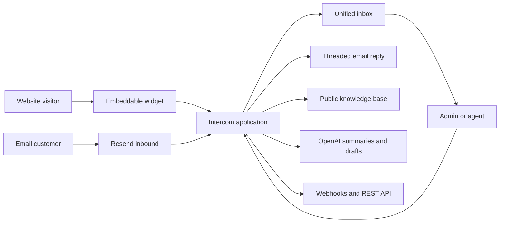
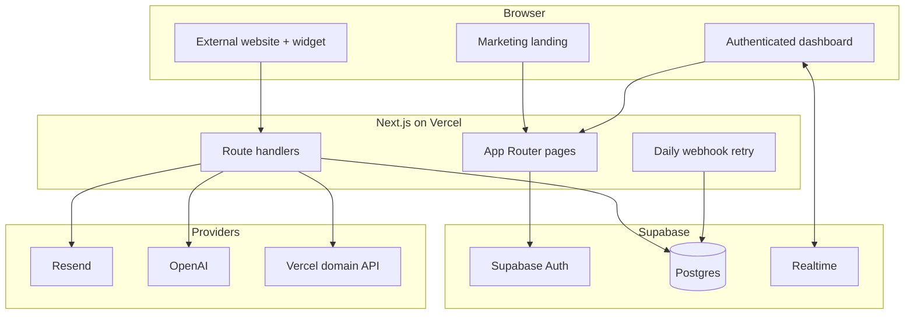
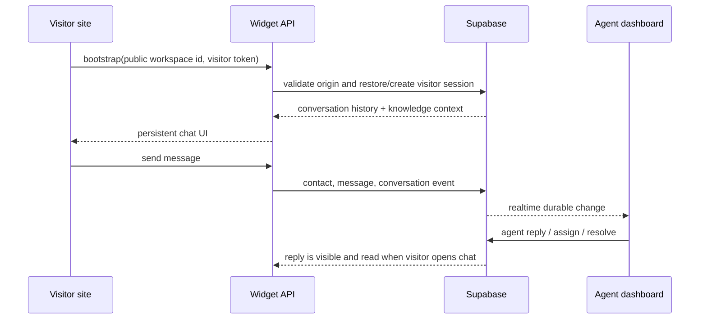
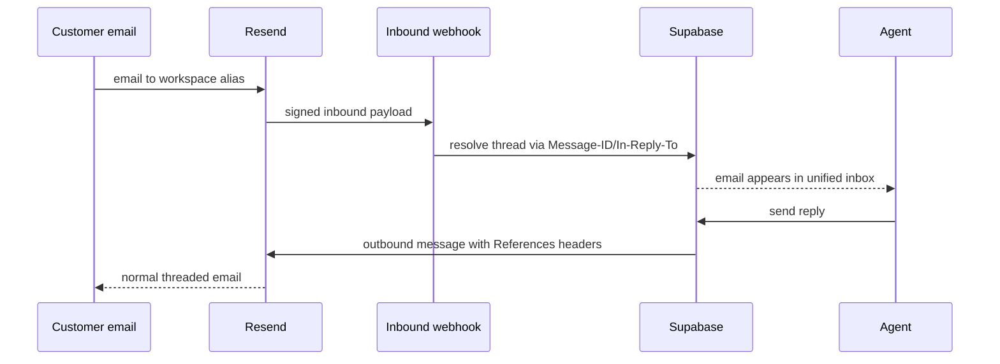
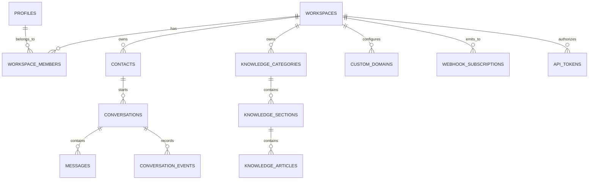

# Intercom

Intercom is a production-oriented customer communication platform for teams
that need to handle live chat and email in one accountable inbox. It gives a
workspace a public help centre, an embeddable chat widget, threaded email,
AI-assisted triage, and the operational controls to run support without
losing customer context.

The product is designed to feel complete from the first visit: the root URL is
an interactive product landing page, authentication leads to workspace
creation, and a newly-created workspace begins empty rather than being mixed
with sample data.

## Product map



| Area | What it does |
| --- | --- |
| Public product | Animated landing page, clear sign-up path, widget demo, and public help-centre experience. |
| Identity | Email/password and Google sign-in through Supabase Auth; workspace onboarding; Admin and Agent roles. |
| Inbox | One filtered inbox for chat and email, with search, assignment, bulk actions, snooze, resolve, SLA state, and realtime refresh. |
| Live chat | A single `<script>` install, visitor continuity via a local visitor token, knowledge suggestions, typing/online state, and durable read status. |
| Email | Resend inbound processing, reply delivery from the dashboard, Message-ID/In-Reply-To threading, and workspace aliases. |
| Knowledge | Categories, sections, rich-text-safe article authoring, publishing, search, and public custom-domain rendering. |
| Intelligence | Concise issue briefs and grounded reply drafts with caching, bounded context, usage recording, and daily request limits. |
| Operations | Team invitations and roles, canned responses, contact timelines, SLA state, analytics, custom domains, API tokens, and webhooks. |

## Feature coverage

### Customer communication

- Email/password and Google authentication.
- Workspace creation, invite acceptance, and Admin/Agent role boundaries.
- A unified inbox with channel, assignee, status, saved-view, and text filters.
- Conversation assignment, reassignment, snooze, resolve/reopen, and bulk
  actions.
- Embedded chat on any approved origin using a single script tag.
- Persistent visitor identity and conversation history across returns.
- Widget message delivery, knowledge suggestions, online state, typing signals,
  and read status for agent replies.
- Incoming Resend mail converted into email conversations.
- Dashboard email replies with normal outbound email behaviour and preserved
  RFC threading headers.

### Knowledge and intelligence

- Category and section creation.
- Safe rich-text article authoring with bold, italic, and list controls.
- Draft/published article lifecycle and searchable public help centre.
- Article suggestions while a visitor types in the widget.
- Automatic summaries for substantive conversations (four or more messages),
  plus an explicit summary action for shorter threads.
- AI reply drafts informed by the last messages and published help articles.
- Contact timeline with past conversations, visits, last-seen state, and
  ownership context.

### Operational extensions

- First-response and resolution SLA calculations with breach state.
- Workspace analytics for volume, response time, resolution time, busiest
  hours, and assigned-agent performance.
- Workspace-scoped canned responses.
- HTTPS webhook subscriptions with encrypted signing-secret handling and retry
  processing.
- Scoped API tokens and a Bearer-token conversations endpoint.
- Customer-facing knowledge-base custom domains with DNS verification and
  optional Vercel-managed TLS attachment.

## Architecture



The application is intentionally a single Next.js deployment instead of a
separate always-on API service. Route handlers own authenticated server work,
Vercel handles deployment and scheduled retries, and Supabase provides the
durable data plane and dashboard realtime channel. This keeps the operational
surface small while retaining clear service boundaries.

### Main request flows





## Data model

Every durable record is tenant-scoped by `workspace_id`. Supabase RLS permits
members to read their workspace data; server handlers perform explicit
membership and role checks before mutations.



Important records include:

- `workspaces`, `profiles`, `workspace_members`, and `workspace_invitations`
  for tenancy and access control.
- `contacts`, `visitor_sessions`, and `contact_page_visits` for customer
  context.
- `conversations`, `messages`, `message_reads`, and `conversation_events` for
  the communication record.
- `knowledge_categories`, `knowledge_sections`, and `knowledge_articles` for
  the help centre.
- `ai_summaries` and `ai_usage_events` for efficient, observable AI work.
- `sla_policies`, `daily_metrics`, `webhook_subscriptions`,
  `webhook_deliveries`, `api_tokens`, and `custom_domains` for operations.

## Directory guide

```text
src/app/                 Pages and API route handlers
src/components/          Dashboard, landing, knowledge, widget-demo UI
src/lib/                 Auth, email, AI, domain, webhook, and data services
Git history              Initial schema and migration history used during setup
```

Notable endpoints:

| Route | Purpose |
| --- | --- |
| `/widget.js` | Cacheable embeddable chat client. |
| `/api/widget/*` | Widget bootstrap, messages, typing signals, and article suggestions. |
| `/api/webhooks/resend` | Signed inbound email delivery. |
| `/api/conversations/[id]/*` | Messages, assignment/status actions, SLA, presence, and AI. |
| `/api/workspaces/[id]/*` | Knowledge, invitations, domains, origins, analytics, roles, tokens, and webhooks. |
| `/api/v1/conversations` | Token-authenticated integration read endpoint. |
| `/api/cron/webhooks` | Retry queue worker protected by a cron secret. |

## Services and configuration

No secret belongs in source control. Copy `.env.example` to `.env.local` for
local development and add the same values in Vercel’s environment settings.

| Service | Required configuration | Role |
| --- | --- | --- |
| Supabase | `NEXT_PUBLIC_SUPABASE_URL`, `NEXT_PUBLIC_SUPABASE_PUBLISHABLE_KEY`, `SUPABASE_SERVICE_ROLE_KEY` | Auth, Postgres, RLS, realtime. |
| Vercel | `NEXT_PUBLIC_APP_URL` | Hosting, custom-domain attachment, scheduled webhook retries. |
| Resend | `RESEND_API_KEY`, `RESEND_WEBHOOK_SECRET`, `RESEND_FROM_EMAIL`, `RESEND_INBOUND_DOMAIN` | Outbound and inbound threaded email. |
| OpenAI | `OPENAI_API_KEY`, `OPENAI_MODEL=gpt-5-mini` | Summaries and reply drafts. |
| Security | `WEBHOOK_ENCRYPTION_KEY`, `CRON_SECRET` | Encrypt outbound webhook secrets and protect scheduled work. |
| Optional domain automation | `VERCEL_TOKEN`, `VERCEL_PROJECT_ID`, optional `VERCEL_TEAM_ID` | Attach verified help-centre hostnames for managed TLS. |

### Supabase authentication URLs

Use the production domain consistently:

```text
Site URL:
https://intercom-tds.vercel.app

Additional Redirect URL:
https://intercom-tds.vercel.app/auth/callback
```

Google OAuth itself must use the Supabase callback shown by Supabase:

```text
https://<project-ref>.supabase.co/auth/v1/callback
```

The application passes the browser’s `/auth/callback` URL to Supabase after
OAuth or email confirmation. Registering only the bare domain is not enough
for that return journey.

### Resend inbound setup

1. Verify the sending domain in Resend and use a verified address, for example
   `shivam@thedotstore.in`, as `RESEND_FROM_EMAIL`.
2. Use the configured receiving domain in `RESEND_INBOUND_DOMAIN`.
3. Configure the Resend inbound webhook as:

   ```text
   https://intercom-tds.vercel.app/api/webhooks/resend
   ```

4. Send a test message to the workspace alias shown under **Settings → Email
   channel**. Replies from the inbox will preserve the original thread.

## AI cost and reliability controls

The default model is `gpt-5-mini`. AI work is deliberately narrow:

- summaries use at most the latest 18 messages, truncating each to 900
  characters;
- output limits are 180 tokens for summaries and 150 for reply drafts;
- summaries are cached by the latest source message and are refreshed only
  when a conversation changes;
- automatic summaries wait for a substantive thread (four messages);
- workspaces are capped at 50 AI requests per day and each request is recorded
  with token usage;
- missing keys, slow providers, and provider failures return a useful error
  without blocking messaging or authentication.

Set the independent monthly project budget in OpenAI to keep spending bounded.

## Security and resilience

- Supabase Auth sessions are managed with `@supabase/ssr` cookies.
- Role checks happen in the API layer for Admin-only changes such as team role
  changes, tokens, domains, integrations, and assignments.
- Server-side services use an explicit admin client only after the request has
  passed tenant membership checks.
- Rich article HTML is sanitized before storage; widget rendering uses text
  nodes rather than raw HTML.
- Widget requests validate approved origins and are rate-limited by endpoint
  and request fingerprint.
- Resend webhooks are verified; outbound webhook signing secrets are encrypted
  at rest and deliveries have a retry queue.
- Inputs are validated with Zod, UUIDs are checked at route boundaries, and
  failures return controlled API errors.
- Email and realtime failures degrade independently: a temporary provider
  error never prevents an agent from navigating the rest of the workspace.

## Local development and verification

```bash
npm install
npm run dev
```

Before a release:

```bash
npm run lint
npm run typecheck
npm run build
```

The repository’s schema migration history was used to initialise the Supabase
project. Apply any migration that has not yet been run before exercising the
corresponding feature. In particular, the workspace email-alias and welcome
email tracking migrations should be present before end-to-end email testing.

## Deployment checklist

- [ ] Production Vercel environment values are present and
      `NEXT_PUBLIC_APP_URL` uses `https://`.
- [ ] Supabase has the exact `/auth/callback` redirect URL listed above.
- [ ] Email/password and Google providers are enabled in Supabase.
- [ ] Resend sender domain is verified, inbound webhook is active, and its
      secret is configured.
- [ ] Supabase schema migrations have been applied.
- [ ] Create a workspace, add its Vercel origin under **Widget install**, and
      open `/demo?workspace=<workspace-public-id>` for a live widget smoke
      test.
- [ ] Send an email to the displayed workspace alias and reply from the inbox.
- [ ] Create a published article and confirm the widget suggests it.

## Production notes

The dashboard uses Supabase realtime subscriptions for durable conversation,
message, and read changes. The untrusted embeddable widget retains a short
polling refresh as a graceful fallback while it uses its own origin-validated
API; this avoids exposing workspace data directly to third-party websites.

Custom-domain verification intentionally separates DNS ownership proof from
TLS attachment. The product can show DNS instructions and verification status
without Vercel credentials; when optional Vercel credentials are supplied, a
verified hostname is attached for managed TLS automatically.
